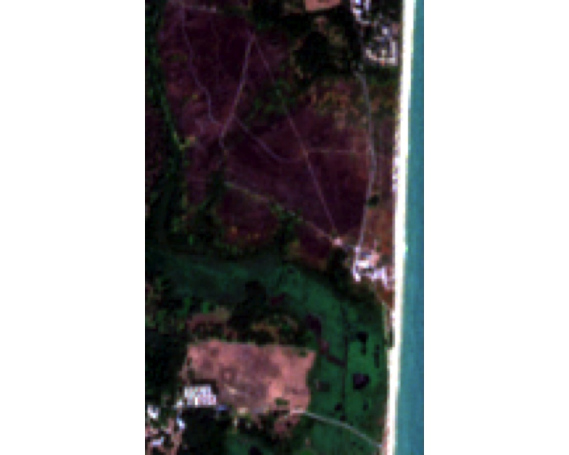
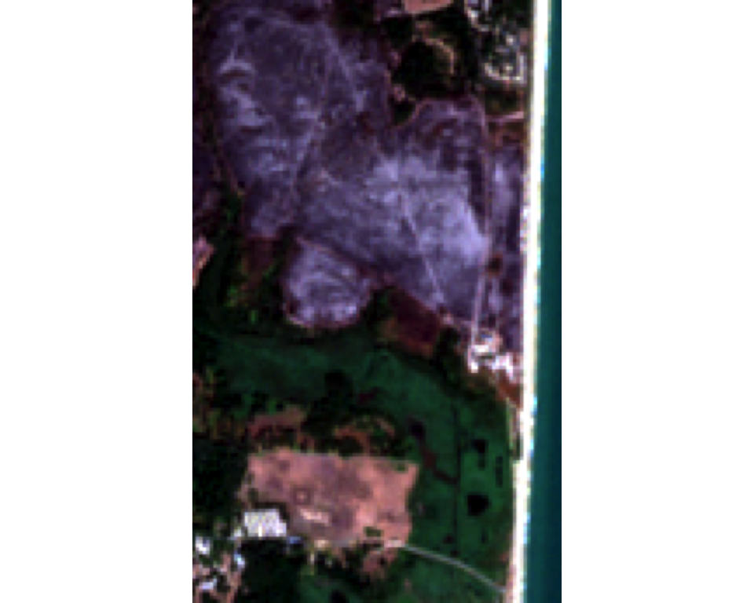
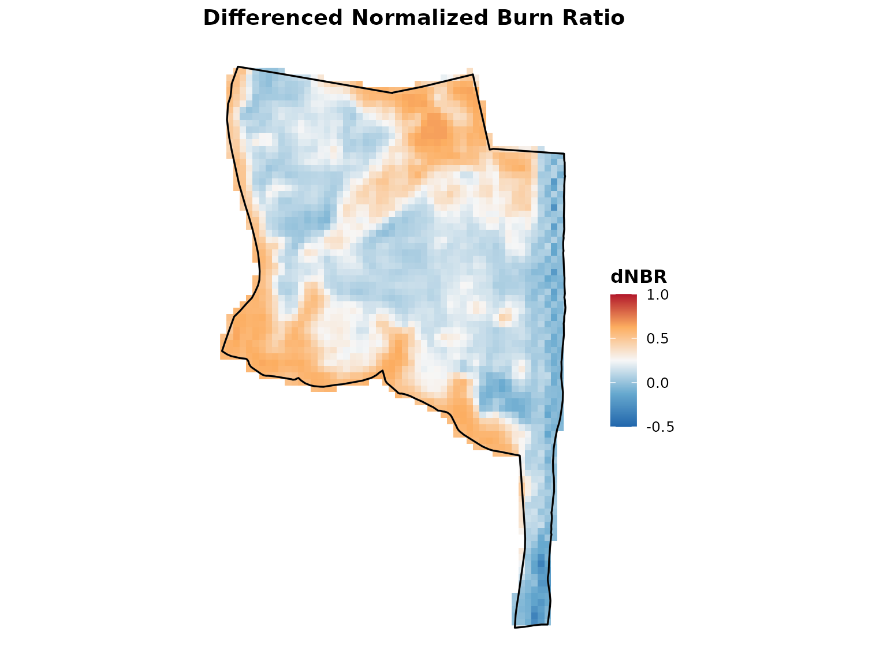
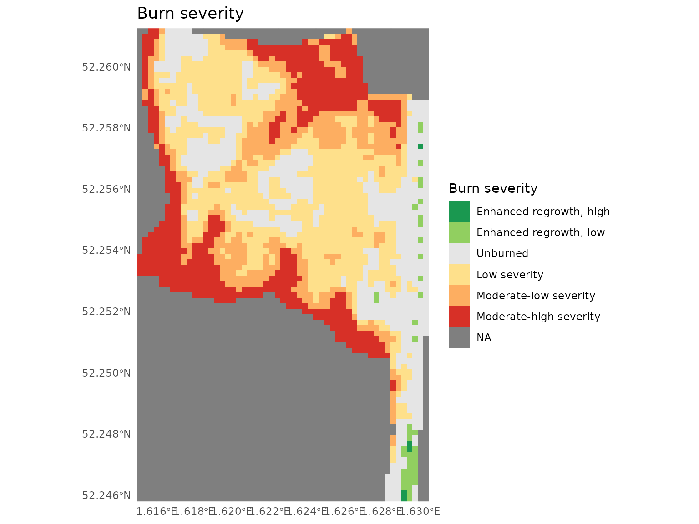
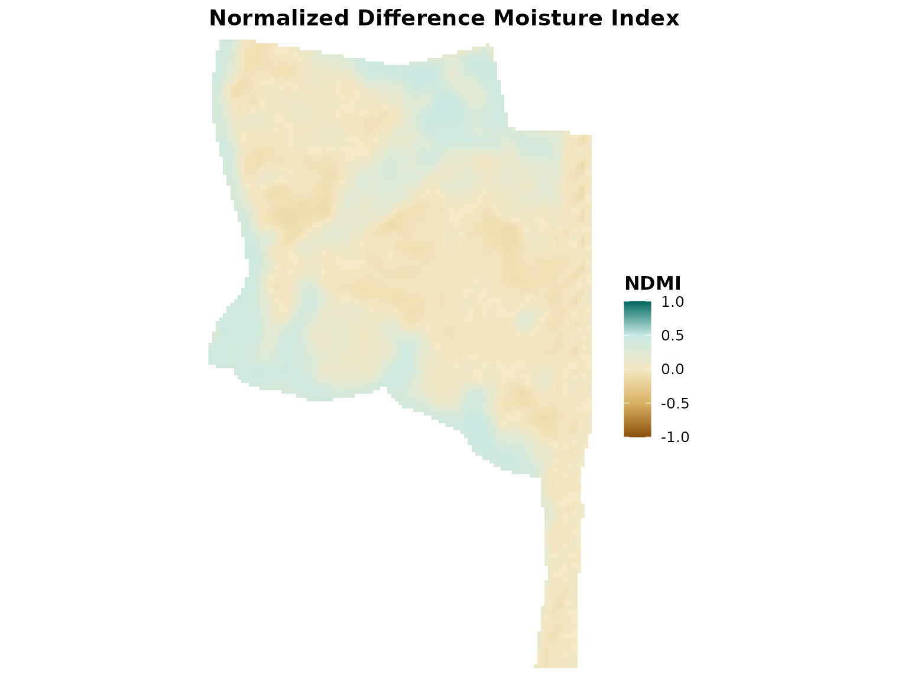
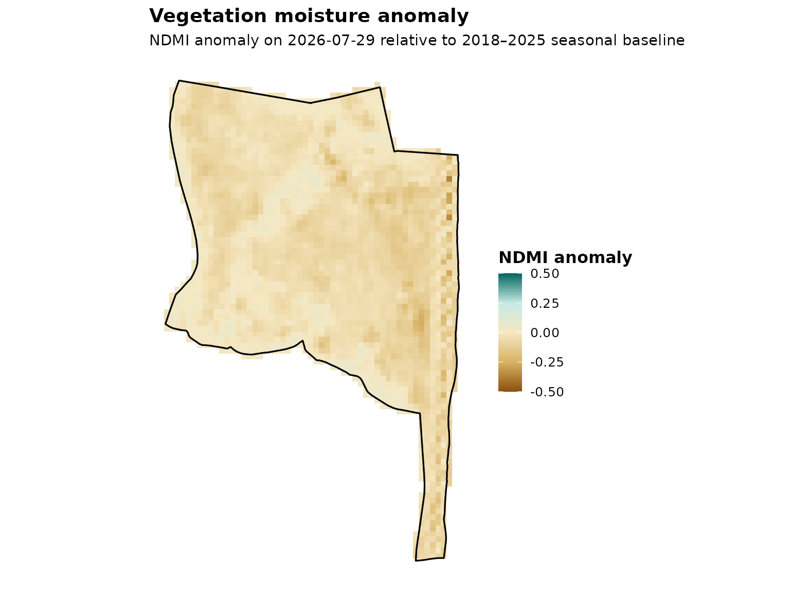
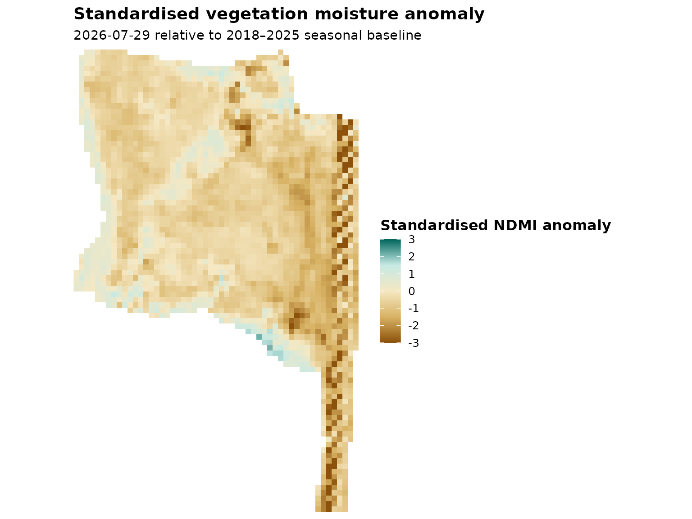
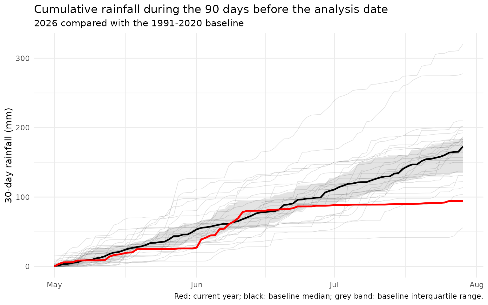
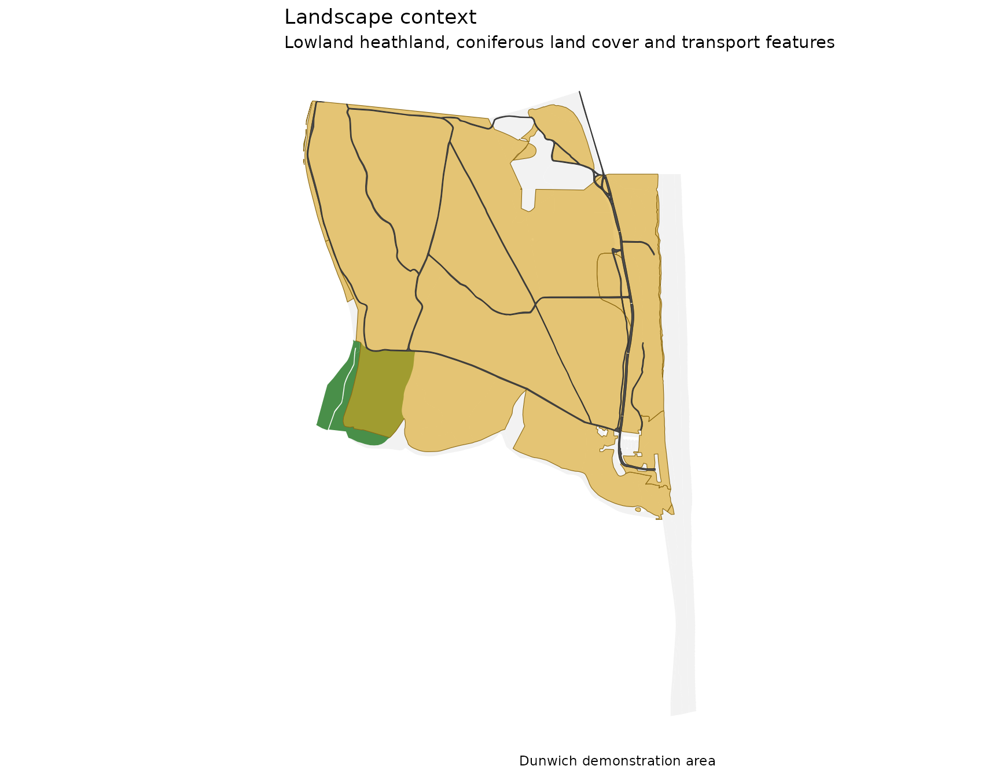

# getting-started

``` r


library(sentinelBurnR)
library(terra)
#> terra 1.9.50
```

## Getting started with sentinelBurnR

`sentinelBurnR` provides tools for analysing wildfire and its
environmental context using satellite and climate data.

The package uses Sentinel-2 multispectral imagery to identify burned
areas and examine vegetation condition. It can also compare vegetation
moisture with historical observations and place these observations in
the context of climate data such as rainfall.

A typical analysis can include:

1.  defining an area of interest;
2.  identifying suitable Sentinel-2 imagery;
3.  comparing pre- and post-fire imagery;
4.  analysing vegetation condition;
5.  assessing vegetation moisture anomalies;
6.  examining recent rainfall and other climate conditions.

This vignette uses data from the Dunwich area of Suffolk, UK, associated
with a wildfire in summer 2026. All example data are included with the
package, so the vignette can be run without downloading data.

## True-colour imagery

Sentinel-2 records reflected light in several parts of the
electromagnetic spectrum. The simplest way to view the imagery is as a
true-colour image, combining the red, green and blue wavelengths to
produce an image similar to that seen by the human eye.

The following images show the Dunwich area before and after the fire.

``` r


pre_visual <- demo_data("visual_pre")

terra::plotRGB(
    pre_visual,
    r = 1,
    g = 2,
    b = 3,
    stretch = "lin"
)
```



``` r

post_visual <- demo_data("visual_post")

terra::plotRGB(
    post_visual,
    r = 1,
    g = 2,
    b = 3,
    stretch = "lin"
)
```



The effects of the fire can be seen in the true-colour imagery, but
visible colour alone is not an ideal way to determine the extent or
severity of burning. Soil, shadows, vegetation type and naturally bare
ground can produce similar changes in appearance.

Sentinel-2 also measures near-infrared and short-wave infrared light,
which provide much stronger information about changes in vegetation
following fire. These wavelengths are used to calculate the Normalized
Burn Ratio (NBR).

Sentinel-2 also measures wavelengths beyond those visible to the human
eye. The Normalized Burn Ratio (NBR) uses near-infrared and short-wave
infrared measurements, which respond strongly to changes in vegetation
and surface condition following fire.

## Demo data

Load the area of interest and the Sentinel-2 collections:

``` r

demo_dir <- system.file(
        "extdata",
        "demo",
        package = "sentinelBurnR"
    )
aoi <- readRDS(
            file.path(demo_dir, "demo_aoi.rds")
        )

pre <- demo_data("pre")
post <- demo_data("post")
```

The collections contain cropped Sentinel-2 imagery for the Dunwich area.
In a normal analysis these collections would instead be created using
[`search_s2()`](../reference/search_s2.md) and
[`download_s2()`](../reference/download_s2.md).

For example, the corresponding workflow is:

``` r

pre_search <- search_s2(
    aoi,
    start = "2026-07-14",
    end = "2026-07-29"
)

post_search <- search_s2(
    aoi,
    start = "2026-07-29",
    end = "2026-08-22"
)

pre <- download_s2(
    pre_search,
    assets = s2_burn_assets
)

post <- download_s2(
    post_search,
    assets = s2_burn_assets
)
```

The code is not evaluated in this vignette because searching and
downloading Sentinel-2 imagery requires an internet connection.

## Burn analysis

Burn severity can be estimated from changes in the Normalized Burn Ratio
(NBR). NBR contrasts near-infrared and short-wave infrared reflectance.
Healthy vegetation generally has high near-infrared reflectance, whereas
recently burned surfaces tend to have relatively higher short-wave
infrared reflectance.

[`analyse_burn()`](../reference/analyse_burn.md) calculates pre- and
post-fire NBR and their difference (dNBR):

``` r

burn <- analyse_burn(
    pre = pre,
    post = post,
    boundary = aoi
)
#> Building pre-fire composite...
#> Building nir08
#> Building swir22
#> Aligning bands...
#> Stacking composite...
#> Caching composite: /home/runner/.cache/R/sentinelBurnR/composites/composite_880e5f32b9fcc85ecad9a367897b4976.tif
#> Building post-fire composite...
#> Building nir08
#> Building swir22
#> Aligning bands...
#> Stacking composite...
#> Caching composite: /home/runner/.cache/R/sentinelBurnR/composites/composite_082aec378f15512e2a95053f86b76e81.tif
#> Calculating NBR...
#> Calculating dNBR...
#> Detecting burned area...
#> Classifying burn severity...

burn
#> sentinelBurnR burn analysis
#> ---------------------------
#> Burn threshold : 0.27 dNBR
#> Burned area    : 118.5 ha
```

The resulting `sbr_burn` object contains the pre- and post-fire
composites, NBR rasters, dNBR, the detected burned area, burn severity
and processing provenance.

The spatial pattern of dNBR can be displayed with:

``` r


plot_index(
    burn$dnbr,
    index = "dnbr",
    boundary = aoi$geometry
)
```



Burn severity can also be mapped directly:

``` r


plot_severity(
    burn$severity,
    boundary = aoi$geometry
)
```



## Vegetation condition

The same pre-fire Sentinel-2 imagery can be used to examine vegetation
condition.

[`analyse_vegetation()`](../reference/analyse_vegetation.md) calculates
three complementary spectral indices:

- **NDVI** — an indicator of vegetation greenness;
- **NDMI** — sensitive to vegetation moisture;
- **MSI** — a moisture-stress index based on near- and short-wave
  infrared reflectance.

``` r

vegetation <- analyse_vegetation(
    pre
)
#> Building vegetation composite...
#> Building red
#> Building nir08
#> Building swir16
#> Aligning bands...
#> Stacking composite...
#> Caching composite: /home/runner/.cache/R/sentinelBurnR/composites/composite_d27f32b2c1eed399c26c4aa1dc9eab94.tif
#> Calculating NDVI...
#> Calculating NDMI...
#> Calculating MSI...

vegetation
#> $composite
#> class       : SpatRaster
#> size        : 173, 106, 3  (nrow, ncol, nlyr)
#> resolution  : 10, 10  (x, y)
#> extent      : 405450, 406510, 5789270, 5791000  (xmin, xmax, ymin, ymax)
#> coord. ref. : WGS 84 / UTM zone 31N (EPSG:32631)
#> source(s)   : memory
#> varname     : S2B_31UCT_20260729_0_L2A_red
#> names       :    red,      nir08,     swir16
#> min values  :    150,   330.5625,     321.25
#> max values  : 2971.5, 4719.34375, 3360.78125
#> 
#> $ndvi
#> class       : SpatRaster
#> size        : 173, 106, 1  (nrow, ncol, nlyr)
#> resolution  : 10, 10  (x, y)
#> extent      : 405450, 406510, 5789270, 5791000  (xmin, xmax, ymin, ymax)
#> coord. ref. : WGS 84 / UTM zone 31N (EPSG:32631)
#> source(s)   : memory
#> varname     : S2B_31UCT_20260729_0_L2A_red
#> name        :      ndvi
#> min value   : -0.324658
#> max value   :  0.914947
#> 
#> $ndmi
#> class       : SpatRaster
#> size        : 173, 106, 1  (nrow, ncol, nlyr)
#> resolution  : 10, 10  (x, y)
#> extent      : 405450, 406510, 5789270, 5791000  (xmin, xmax, ymin, ymax)
#> coord. ref. : WGS 84 / UTM zone 31N (EPSG:32631)
#> source(s)   : memory
#> varname     : S2B_31UCT_20260729_0_L2A_red
#> name        :      ndmi
#> min value   : -0.142421
#> max value   :   0.48973
#> 
#> $msi
#> class       : SpatRaster
#> size        : 173, 106, 1  (nrow, ncol, nlyr)
#> resolution  : 10, 10  (x, y)
#> extent      : 405450, 406510, 5789270, 5791000  (xmin, xmax, ymin, ymax)
#> coord. ref. : WGS 84 / UTM zone 31N (EPSG:32631)
#> source(s)   : memory
#> varname     : S2B_31UCT_20260729_0_L2A_red
#> name        :      msi
#> min value   : 0.342525
#> max value   : 1.332146
#> 
#> $assets
#> [1] "red"    "nir08"  "swir16"
#> 
#> $provenance
#> $provenance$collection
#> $provenance$collection$summary
#> $provenance$collection$summary$start
#> [1] "2026-07-14"
#> 
#> $provenance$collection$summary$end
#> [1] "2026-07-29"
#> 
#> $provenance$collection$summary$n_acquisitions
#> [1] 9
#> 
#> $provenance$collection$summary$satellites
#> [1] "sentinel-2a" "sentinel-2b" "sentinel-2c"
#> 
#> $provenance$collection$summary$mean_cloud
#> [1] 54.66376
#> 
#> $provenance$collection$summary$max_cloud
#> [1] 91.25531
#> 
#> 
#> $provenance$collection$scenes
#>                 acquisition       date   satellite cloud_cover cloud_shadow
#> 1  S2B_31UCT_20260729_0_L2A 2026-07-29 sentinel-2b    0.020469     0.001558
#> 2  S2B_31UDT_20260729_0_L2A 2026-07-29 sentinel-2b    0.013266     0.000000
#> 3  S2B_31UCU_20260729_0_L2A 2026-07-29 sentinel-2b    0.296559     0.032196
#> 4  S2B_31UDU_20260729_0_L2A 2026-07-29 sentinel-2b    0.146638     0.000000
#> 5  S2A_31UCT_20260726_1_L2A 2026-07-26 sentinel-2a   57.806909     5.944328
#> 6  S2A_31UDT_20260726_1_L2A 2026-07-26 sentinel-2a   49.149847     6.212101
#> 7  S2A_31UCU_20260726_1_L2A 2026-07-26 sentinel-2a   63.898134     6.752651
#> 8  S2A_31UDU_20260726_1_L2A 2026-07-26 sentinel-2a   44.819829     1.586617
#> 9  S2B_31UCT_20260726_0_L2A 2026-07-26 sentinel-2b   59.447420     4.462055
#> 10 S2B_31UDT_20260726_0_L2A 2026-07-26 sentinel-2b   85.793304     0.585137
#> 11 S2B_31UCU_20260726_0_L2A 2026-07-26 sentinel-2b   58.542842     6.156673
#> 12 S2B_31UDU_20260726_0_L2A 2026-07-26 sentinel-2b   60.375458     0.388108
#> 13 S2C_31UCT_20260724_0_L2A 2026-07-24 sentinel-2c   93.496507     0.067226
#> 14 S2C_31UDT_20260724_0_L2A 2026-07-24 sentinel-2c   99.997443     0.002480
#> 15 S2C_31UCU_20260724_0_L2A 2026-07-24 sentinel-2c   85.245407     0.368619
#> 16 S2C_31UDU_20260724_0_L2A 2026-07-24 sentinel-2c   86.281878     1.422731
#> 17 S2C_31UCT_20260721_0_L2A 2026-07-21 sentinel-2c   92.977858     0.270971
#> 18 S2C_31UDT_20260721_0_L2A 2026-07-21 sentinel-2c   80.271119     0.000000
#> 19 S2C_31UCU_20260721_0_L2A 2026-07-21 sentinel-2c   96.034640     0.316426
#> 20 S2C_31UDU_20260721_0_L2A 2026-07-21 sentinel-2c   86.710948     0.028802
#> 21 S2B_31UCT_20260719_0_L2A 2026-07-19 sentinel-2b   92.181081     0.288699
#> 22 S2B_31UDT_20260719_0_L2A 2026-07-19 sentinel-2b   94.294757     0.441914
#> 23 S2B_31UCU_20260719_0_L2A 2026-07-19 sentinel-2b   87.668514     1.529551
#> 24 S2B_31UDU_20260719_0_L2A 2026-07-19 sentinel-2b   41.086638     2.434609
#> 25 S2A_31UCT_20260716_1_L2A 2026-07-16 sentinel-2a   11.283074     1.741456
#> 26 S2A_31UDT_20260716_1_L2A 2026-07-16 sentinel-2a   64.281458     1.111696
#> 27 S2A_31UCU_20260716_1_L2A 2026-07-16 sentinel-2a   53.769338     0.053988
#> 28 S2A_31UDU_20260716_1_L2A 2026-07-16 sentinel-2a   58.974522     0.219789
#> 29 S2B_31UCT_20260716_0_L2A 2026-07-16 sentinel-2b   12.013546     1.331907
#> 30 S2B_31UDT_20260716_0_L2A 2026-07-16 sentinel-2b   53.367269     0.186141
#> 31 S2B_31UCU_20260716_0_L2A 2026-07-16 sentinel-2b   56.026661     0.047424
#> 32 S2B_31UDU_20260716_0_L2A 2026-07-16 sentinel-2b   62.731332     0.098978
#> 33 S2C_31UCT_20260714_0_L2A 2026-07-14 sentinel-2c   21.092790     3.407308
#> 34 S2C_31UDT_20260714_0_L2A 2026-07-14 sentinel-2c    2.893100     0.591929
#> 35 S2C_31UCU_20260714_0_L2A 2026-07-14 sentinel-2c   47.778782     2.766099
#> 36 S2C_31UDU_20260714_0_L2A 2026-07-14 sentinel-2c    7.125969     1.367231
#>    medium_cloud high_cloud vegetation     water
#> 1      0.010879   0.003847  26.385432 25.363782
#> 2      0.012973   0.000000  17.418432 69.230020
#> 3      0.045482   0.017396  32.294354 28.489918
#> 4      0.006485   0.000042  10.688163 80.414653
#> 5     16.620876  39.658967   8.979121  9.355063
#> 6     10.678989  35.723552   9.470054 26.974240
#> 7     14.327103  48.620832   8.944158  6.949569
#> 8     12.793224  26.749340   5.850336 42.055705
#> 9     15.230985  42.026439   8.328012 10.792446
#> 10    12.977910  71.425444   0.217813 13.311632
#> 11    14.967820  41.762701  10.491603  8.763479
#> 12    15.935110  34.708661   1.600147 35.907680
#> 13    34.826180   9.598876   1.932757  0.609031
#> 14    51.267093  19.106279   0.000000  0.000077
#> 15    14.464720   4.414269   2.104641  9.177823
#> 16    13.598995  24.533899   0.122713 12.106331
#> 17     2.002415  90.591615   0.000013  6.721082
#> 18    11.201393  68.520612   0.000000 19.728799
#> 19     6.783435  89.242190   0.000313  3.622164
#> 20    15.739433  70.248669   0.000000 13.260245
#> 21    15.533684  67.825770   1.078279  3.822456
#> 22     7.463553  86.608386   0.000000  5.262013
#> 23    16.475289  68.887717   0.696217  9.082729
#> 24    13.598707  23.410174   1.735700 53.139818
#> 25     2.986585   1.241808  25.987160 23.569296
#> 26    34.914330  12.174066   3.749198 27.970502
#> 27     9.181809  22.395857  19.819400  6.370837
#> 28    25.229946  21.274963   4.870258 31.812406
#> 29     3.376937   1.161595  22.994469 28.827208
#> 30    26.956859   9.300235   0.115720 46.256578
#> 31     9.582403  24.486841  18.546295  5.604890
#> 32    27.489486  14.771165   1.120577 34.993145
#> 33     8.516841  12.572250  22.260556 21.936375
#> 34     1.753080   1.140019  19.594200 65.656966
#> 35    10.051285  37.726849  16.589238 15.624268
#> 36     5.013417   2.111362   7.277124 78.533292
#> 
#> $provenance$collection$acquisitions
#>         date   satellite cloud_cover            acquisition
#> 7 2026-07-14 sentinel-2c   19.722660 sentinel-2c_2026-07-14
#> 1 2026-07-16 sentinel-2a   47.077098 sentinel-2a_2026-07-16
#> 3 2026-07-16 sentinel-2b   46.034702 sentinel-2b_2026-07-16
#> 4 2026-07-19 sentinel-2b   78.807748 sentinel-2b_2026-07-19
#> 8 2026-07-21 sentinel-2c   88.998641 sentinel-2c_2026-07-21
#> 9 2026-07-24 sentinel-2c   91.255309 sentinel-2c_2026-07-24
#> 2 2026-07-26 sentinel-2a   53.918680 sentinel-2a_2026-07-26
#> 5 2026-07-26 sentinel-2b   66.039756 sentinel-2b_2026-07-26
#> 6 2026-07-29 sentinel-2b    0.119233 sentinel-2b_2026-07-29
#> 
#> 
#> $provenance$processing
#> $provenance$processing$assets
#> [1] "red"    "nir08"  "swir16"
#> 
#> $provenance$processing$created
#> [1] "2026-10-01 09:52:32 UTC"
#> 
#> $provenance$processing$package_version
#> [1] "0.0.1"
#> 
#> $provenance$processing$indices
#> [1] "NDVI" "NDMI" "MSI" 
#> 
#> 
#> 
#> attr(,"class")
#> [1] "sbr_vegetation"
```

For example, pre-fire vegetation moisture can be mapped using NDMI:

``` r

plot_index(
    vegetation$ndmi,
    index = "ndmi"
)
```



These indices describe vegetation condition at the time of observation.
A low NDMI value alone does not demonstrate drought: vegetation moisture
varies naturally between vegetation types and through the growing
season. To assess whether conditions were unusually dry, the current
observation can instead be compared with observations from previous
years.

## Vegetation moisture anomaly

Vegetation moisture at a single point in time is difficult to interpret
in isolation. NDMI varies between vegetation types and also changes
seasonally.

To provide historical context, `sentinelBurnR` can compare current NDMI
with observations from the same part of the growing season in previous
years.

For this example, the package includes annual NDMI composites for
2018–2025 and a pre-fire observation from 29 July 2026.

``` r

historical_ndmi <- demo_data("drought_historical")
current_ndmi <- demo_data("drought_current")
```

The historical data contain one seasonal NDMI composite for each year:

``` r

names(historical_ndmi)
#> [1] "2018" "2019" "2020" "2021" "2022" "2023" "2024" "2025"
```

For the demonstration we can analyse these already-prepared rasters:

``` r

drought <- sentinelBurnR:::analyse_drought_rasters(
    annual = historical_ndmi,
    current = current_ndmi[["2026-07-29"]],
    current_date = "2026-07-29"
)

drought
#> <sbr_drought>
#> Current date:      2026-07-29
#> Baseline:          2018-2025 (8 years)
#> Seasonal window:   °C30 days
#> Valid coverage:    100.0%
#> Median anomaly:    -0.050
#> Pixels below -2SD: 5.1%
```

The anomaly is calculated as the difference between current NDMI and the
historical seasonal baseline. Negative values therefore indicate
vegetation that was less moisture-rich than expected for the time of
year.

For the Dunwich example, median NDMI on 29 July 2026 was approximately
0.05 below the 2018–2025 seasonal baseline. This indicates relatively
dry vegetation conditions before the fire, although the anomaly should
not by itself be interpreted as a direct measure of drought severity.

``` r

plot_drought(
    drought,
    index = "anomaly",
    boundary = aoi$geometry
)
```



A standardised anomaly is also available:

``` r

plot_drought(
    drought,
    index = "standardised",
    boundary = aoi$geometry
)
```



The standardised anomaly expresses the departure relative to historical
interannual variability. Where historical variability is very small,
standardisation can become unstable, so `sentinelBurnR` masks pixels
whose historical standard deviation falls below a minimum threshold.
Absolute NDMI anomaly therefore remains an important part of the
interpretation.

## Rainfall and climate context

The Sentinel-2 moisture anomaly indicates whether vegetation was
unusually dry compared with previous years. It does not, by itself, tell
us why the vegetation was dry.

Meteorological observations provide an independent line of evidence.
`sentinelBurnR` can compare recent rainfall and temperature with the
equivalent periods during a historical climate baseline. Here we use
1991–2020 as the reference period.

For a full analysis,
[`get_climate_baseline()`](../reference/get_climate_baseline.md)
downloads the required ERA5 data for both the analysis year and the
baseline years. Only the months needed to calculate the requested
climate windows are retrieved.

``` r

climate_data <- sentinelBurnR::get_climate_baseline(
    boundary = aoi,
    date = as.Date("2026-07-29"),
    baseline_years = 1991:2020
)

climate <- sentinelBurnR::analyse_climate(
    rainfall = climate_data$rainfall,
    temperature = climate_data$temperature,
    date = as.Date("2026-07-29"),
    baseline_years = 1991:2020,
    windows = c(30, 60, 90)
)

climate
```

Downloading ERA5 data requires access to the Copernicus Climate Data
Store. To keep this vignette reproducible without network access, the
executable example below uses rainfall data bundled with the package.

``` r

rainfall <- demo_data("rainfall")

climate <- sentinelBurnR::analyse_climate(
    rainfall = rainfall,
    date = as.Date("2026-07-29"),
    baseline_years = 1991:2020,
    windows = c(30, 60, 90)
)

climate$summary |>
    dplyr::transmute(
        `Period (days)` = window_days,
        `2026 rainfall (mm)` = current_mm,
        `1991–2020 median (mm)` = baseline_median_mm,
        `Rainfall anomaly (mm)` = anomaly_mm,
        `% of historical median` = percent_of_normal,
        `Historical percentile` = historical_percentile
    ) |>
    knitr::kable(
        digits = 1,
        caption = paste(
            "Rainfall before 29 July 2026 compared with",
            "the equivalent periods in the 1991–2020 baseline."
        )
    )
```

| Period (days) | 2026 rainfall (mm) | 1991–2020 median (mm) | Rainfall anomaly (mm) | % of historical median | Historical percentile |
|---:|---:|---:|---:|---:|---:|
| 30 | 6.8 | 62.3 | -55.5 | 11.0 | 0.0 |
| 60 | 68.4 | 123.4 | -54.9 | 55.5 | 20.0 |
| 90 | 94.3 | 172.8 | -78.5 | 54.6 | 3.3 |

Rainfall before 29 July 2026 compared with the equivalent periods in the
1991–2020 baseline. {.table}

The percentage of normal rainfall compares the observed rainfall total
with the median of the equivalent periods in the baseline years. Values
below 100% indicate less rainfall than the historical median.

The historical percentile provides a complementary measure. It ranks the
current rainfall total against the equivalent periods in the 30 baseline
years. With a 30-year baseline, the percentile is an empirical ranking
within a relatively small sample. A value of 0%, for example, means that
the current value was below all 30 baseline values; it should not be
interpreted as a literal estimate of a zero-percent climatological
probability.

The same comparison can be visualised directly.

``` r


sentinelBurnR::plot_climate_history(
    rainfall = rainfall,
    date = as.Date("2026-07-29"),
    baseline_years = 1991:2020,
    period_days = 90
)
```



The cumulative rainfall trajectory shows how rainfall developed during
the 90 days preceding the fire. Each faint line represents the
equivalent period in one of the 1991–2020 baseline years. The black line
shows the daily median of those years and the grey band their
interquartile range. The red line shows rainfall during 2026.

This comparison shows not only the rainfall deficit at the end of the
period, but also when conditions began to diverge from the historical
baseline. It therefore complements the 30-, 60- and 90-day summary
statistics above.

Rainfall substantially below the historical median provides
meteorological evidence that a negative vegetation moisture anomaly
occurred during an unusually dry period. The two measurements are
independent: Sentinel-2 describes the condition of the vegetation,
whereas ERA5 describes the meteorological conditions preceding the
satellite observation.

When temperature data are supplied to
[`analyse_climate()`](../reference/analyse_climate.md), the same
analysis also compares recent temperature with the historical baseline.

``` r

climate$temperature

sentinelBurnR::plot_climate(
    climate,
    metric = "temperature"
)
```

Temperature anomalies are expressed in degrees Celsius relative to the
baseline, while the historical percentile describes where the current
temperature lies among the equivalent periods in the baseline years. As
with rainfall, these percentiles are empirical rankings within the
baseline sample rather than estimates of climatological probability.

### Prolonged dry weather

Total rainfall does not tell us how rain was distributed through time. A
similar total could result from frequent small showers or from a long
period with almost no rain.
[`analyse_climate()`](../reference/analyse_climate.md) therefore also
examines the duration of dry spells.

``` r

climate$dry_spell
#>   window_days threshold_mm max_consecutive_dry_days days_since_rain dry_days
#> 1          90            1                       32               3       68
#>   dry_spell_start dry_spell_end
#> 1      2026-06-24    2026-07-25
```

By default, a day with less than 1 mm of rainfall is treated as a dry
day. The result reports the number of dry days in the analysis window,
the longest consecutive dry spell, its start and end dates, and the
number of days since the most recent day with at least 1 mm of rain.

The current dry spell can also be compared with the equivalent period in
each baseline year.

``` r

climate$dry_spell_baseline[c(
    "median_days",
    "max_days",
    "percentile"
)]
#> $median_days
#> [1] 13.5
#> 
#> $max_days
#> [1] 36
#> 
#> $percentile
#> [1] 96.66667
```

The baseline median describes the typical longest dry spell during the
equivalent historical period. The percentile shows how the current
longest dry spell ranks among the baseline years.

Taken together, rainfall, temperature, dry-spell and satellite
observations provide complementary evidence about the environmental
conditions preceding a fire. Rainfall describes water input, temperature
influences evaporative demand, and Sentinel-2 measures the condition of
the vegetation itself.

These observations describe environmental conditions. They do not
establish the cause of a fire or, by themselves, quantify wildfire risk.

### Landscape context

Wildfire behaviour is influenced not only by vegetation condition and
recent weather, but also by the spatial arrangement of fuels and other
landscape features. Interfaces between vegetation types can be
particularly important, as can roads, tracks and other features that may
affect access, suppression and fuel continuity.

[`analyse_landscape()`](../reference/analyse_landscape.md) provides
tools for describing these relationships. It does not calculate a
wildfire risk score; instead, it reports measurable landscape
characteristics that can be interpreted alongside vegetation, drought
and climate information.

``` r

landcover <- demo_data("landcover")
habitat <- demo_data("habitat")
transport <- demo_data("transport")
```

For the Dunwich example, we examine the interface between lowland
heathland and coniferous land cover. Priority habitat polygons provide
the heathland mapping, while coniferous cover is identified from OS
land-cover classes.

``` r

heath <- habitat |>
    dplyr::filter(
        stringr::str_detect(
            mainhabs,
            "Lowland heathland"
        )
    )

conifer <- landcover |>
    dplyr::filter(
        purrr::map_lgl(
            oslandcovertierb,
            \(x) any(
                x %in% c(
                    "Coniferous Trees",
                    "Scattered Coniferous Trees"
                )
            )
        )
    )
```

``` r

landscape <- sentinelBurnR::analyse_landscape(
    landcover = landcover,
    category = "lcb",
    habitat = habitat,
    transport = transport,
    interfaces = list(
        heath_conifer = list(
            source = heath,
            target = conifer,
            source_label = "Lowland heathland",
            target_label = "Coniferous land cover"
        )
    ),
    distances = c(0, 10, 25, 50, 100)
)

landscape
#> <sbr_landscape>
#> Land-cover classes: 22 
#> Transport classes: 2 
#> 
#> Source boundary near target:
#>  1 
#> 
#> Target area by distance from source:
#> # A tibble: 5 × 6
#>   interface     source            target           distance_m length_m length_km
#>   <chr>         <chr>             <chr>                 <dbl>    <dbl>     <dbl>
#> 1 heath_conifer Lowland heathland Coniferous land…          0     625.     0.625
#> 2 heath_conifer Lowland heathland Coniferous land…         10     931.     0.931
#> 3 heath_conifer Lowland heathland Coniferous land…         25    1010.     1.01 
#> 4 heath_conifer Lowland heathland Coniferous land…         50    1116.     1.12 
#> 5 heath_conifer Lowland heathland Coniferous land…        100    1321.     1.32 
#> 
#> Transport coinciding with source boundary near target:
#> # A tibble: 4 × 6
#>   interface     source            target                lower_m upper_m area_ha
#>   <chr>         <chr>             <chr>                   <dbl>   <dbl>   <dbl>
#> 1 heath_conifer Lowland heathland Coniferous land cover       0      10   3.67 
#> 2 heath_conifer Lowland heathland Coniferous land cover      10      25   0.477
#> 3 heath_conifer Lowland heathland Coniferous land cover      25      50   0.512
#> 4 heath_conifer Lowland heathland Coniferous land cover      50     100   0.250
#> 
#> Transport at interface:
#> # A tibble: 10 × 7
#>    interface     source            target category distance_m length_m length_km
#>    <chr>         <chr>             <chr>  <chr>         <dbl>    <dbl>     <dbl>
#>  1 heath_conifer Lowland heathland Conif… Track             0      0      0     
#>  2 heath_conifer Lowland heathland Conif… Road              0      0      0     
#>  3 heath_conifer Lowland heathland Conif… Track            10      0      0     
#>  4 heath_conifer Lowland heathland Conif… Road             10      0      0     
#>  5 heath_conifer Lowland heathland Conif… Track            25     11.5    0.0115
#>  6 heath_conifer Lowland heathland Conif… Road             25      0      0     
#>  7 heath_conifer Lowland heathland Conif… Track            50     11.7    0.0117
#>  8 heath_conifer Lowland heathland Conif… Road             50      0      0     
#>  9 heath_conifer Lowland heathland Conif… Track           100     12.4    0.0124
#> 10 heath_conifer Lowland heathland Conif… Road            100      0      0
```

The interface results are complementary measures. `interface_summary`
reports the cumulative length of heathland boundary with coniferous
cover within each specified distance. `interface_bands` reports the area
of coniferous cover in mutually exclusive distance bands around the
heathland.

In this example, mapped coniferous cover is strongly concentrated close
to the heathland boundary. This describes the spatial relationship
between the two mapped cover types; it should not by itself be
interpreted as a measure of wildfire probability or expected fire
behaviour.

``` r

landscape$interface_bands |>
    dplyr::transmute(
        Interface = interface,
        `Distance from heath (m)` =
            paste0(lower_m, "–", upper_m),
        `Conifer area (ha)` = area_ha
    ) |>
    knitr::kable(
        digits = 2,
        caption =
            "Coniferous land cover by distance from mapped lowland heathland."
    )
```

| Interface     | Distance from heath (m) | Conifer area (ha) |
|:--------------|:------------------------|------------------:|
| heath_conifer | 0–10                    |              3.67 |
| heath_conifer | 10–25                   |              0.48 |
| heath_conifer | 25–50                   |              0.51 |
| heath_conifer | 50–100                  |              0.25 |

Coniferous land cover by distance from mapped lowland heathland.
{.table}

In this demonstration area, very little of the heathland boundary near
conifer coincides with mapped transport features. A mapped road or track
should not automatically be interpreted as an effective firebreak: its
importance depends on characteristics such as width, surface,
surrounding vegetation, condition and accessibility.

``` r


aoi_sf <- aoi |>
    sentinelBurnR:::aoi_to_spatvector() |>
    sf::st_as_sf()

ggplot2::ggplot() +
    ggplot2::geom_sf(
        data = landcover,
        fill = "grey95",
        colour = NA
    ) +
    ggplot2::geom_sf(
        data = conifer,
        fill = "darkgreen",
        colour = NA,
        alpha = 0.7
    ) +
    ggplot2::geom_sf(
        data = heath,
        fill = "goldenrod",
        colour = "goldenrod4",
        alpha = 0.6
    ) +
    ggplot2::geom_sf(
        data = transport,
        fill = "grey30",
        colour = "grey20"
    ) +
    ggplot2::geom_sf(
        data = aoi_sf,
        fill = NA,
        colour = "black",
        linewidth = 0.5
    ) +
    ggplot2::coord_sf(datum = NA) +
    ggplot2::labs(
        title = "Landscape context",
        subtitle = "Lowland heathland, coniferous land cover and transport features",
        caption = "Dunwich demonstration area"
    ) +
    ggplot2::theme_minimal()
```



#### NBR — Normalized Burn Ratio

NBR is a way of using satellite imagery to distinguish healthy
vegetation from recently burned ground. Healthy green vegetation
reflects a lot of near-infrared light, while burned, dry and charred
surfaces tend to reflect relatively more short-wave infrared light. NBR
combines these two parts of the spectrum into a single number. In
general, high NBR indicates healthy vegetation, while lower NBR is
associated with sparse, dry or burned vegetation. The important point is
that NBR alone does not tell us that a fire has occurred. Different
vegetation and soil types naturally have different NBR values. It
becomes much more useful when we compare images from before and after a
fire.

#### dNBR — change caused by the fire

dNBR measures how much NBR changed between the pre-fire and post-fire
satellite images. It is calculated approximately as:
``` math
dNBR = NBR_{before} - NBR_{after}
```
If vegetation was healthy before the fire and subsequently burned, NBR
falls and dNBR becomes positive. So, broadly: little change around zero
→ little evidence of burning; larger positive values → a stronger change
consistent with burning; negative values → vegetation became greener or
wetter rather than more burned. This makes dNBR particularly useful for
mapping the burn scar, because it measures change rather than simply
looking for dark or bare ground.

#### Burn severity

Burn severity turns the continuous dNBR values into categories that are
easier to interpret on a map. Pixels with a small change may be
classified as unburned or very lightly affected, while increasingly
large changes can be classified into progressively higher burn-severity
classes. The important distinction is that this is satellite-derived
burn severity. It describes the magnitude of the change in vegetation
and surface reflectance detected by Sentinel-2. It is not necessarily
identical to ecological damage measured on the ground—for example, tree
mortality, depth of soil heating or loss of particular species. So a
useful plain-English description is: Burn severity shows where the fire
produced the greatest change to the vegetation and ground surface
visible from the satellite.

### \#Vegetation condition

The vegetation analysis uses several satellite indices that respond to
different aspects of vegetation condition. NDVI mainly describes
vegetation greenness and density. Healthy, actively growing vegetation
generally has higher NDVI. NDMI is more sensitive to vegetation
moisture. Lower values can indicate drier vegetation, although naturally
dry vegetation types can also have low NDMI. MSI is another measure of
vegetation moisture stress. Unlike NDMI, higher MSI generally
corresponds to greater moisture stress. These measurements are useful
for asking questions such as “Was the vegetation unusually dry before
the fire?” But a single satellite image cannot answer that very well,
because heathland, woodland and grassland naturally have different
values and all change through the seasons.

#### Vegetation moisture anomaly

This is why the historical comparison is important. A vegetation
moisture anomaly asks whether the vegetation is wetter or drier than
would normally be expected at that location and time of year. For
example, in the Dunwich analysis we compare the NDMI observed on 29 July
2026 with NDMI from the same part of the growing season in 2018–2025. We
calculate:
``` math
\text{NDMI anomaly}
=
\text{current NDMI}
-
\text{historical NDMI}
```
Therefore: zero → approximately normal; positive → wetter/moister
vegetation than usual; negative → drier vegetation than usual. At
Dunwich the median anomaly was about −0.05, meaning vegetation moisture
was generally lower than its recent historical seasonal baseline.

Standardised vegetation moisture anomaly The absolute anomaly tells us
how much NDMI changed. The standardised anomaly asks a slightly
different question: How unusual is that change compared with the amount
this location normally varies from year to year?

It is essentially:
``` math
\frac{\text{current NDMI} - \text{historical average}}
     {\text{historical variability}}
```
A value around −2, for example, means vegetation moisture is roughly two
historical standard deviations below normal. This can help distinguish a
place that is slightly dry but naturally very variable from one
experiencing conditions that are genuinely unusual for that location.
There is an important caveat: if a pixel normally varies very little,
dividing by a very small historical variability can produce misleadingly
extreme values. That’s why sentinelBurnR masks locations where the
historical standard deviation is very small.

#### Drought anomaly versus drought

I’d make this distinction explicit in the vignette: A negative
vegetation moisture anomaly is evidence of unusually dry vegetation, but
it is not by itself proof of meteorological drought.

Sentinel-2 tells us about the response of the vegetation. ERA5 rainfall
tells us about the weather conditions that may have produced that
response. In your Dunwich example, those two independent lines of
evidence can then be considered together.
